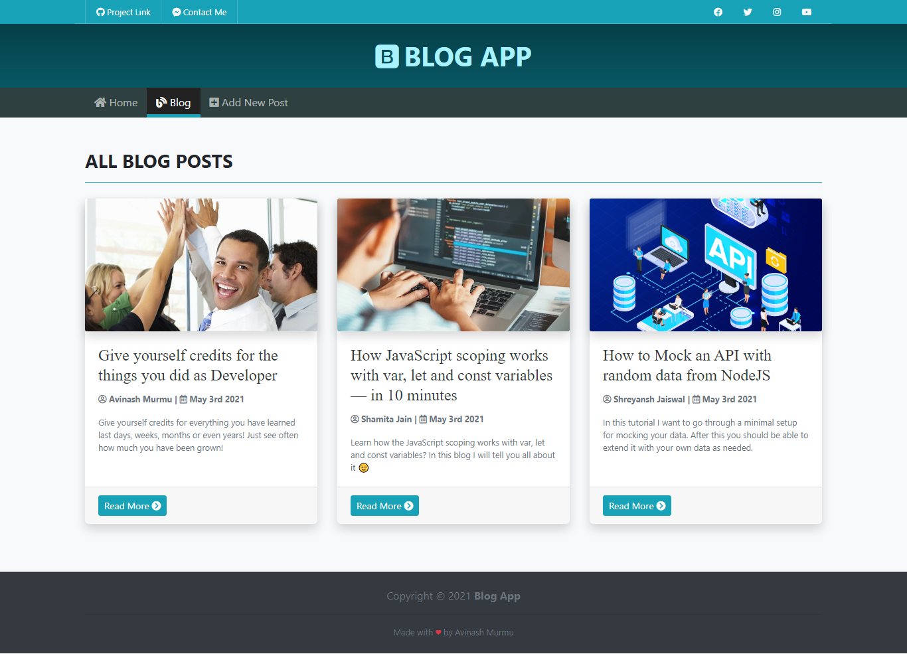

# Blog App

A simple blog app using NodeJS & Express.

\
\
||||||||||||||||||||
### __Features__

- All the CRUD functionalities
- `author`, `date`, `post thumbnail`, `summary` fields
- __SummerNote__ WYSIWYG Text Editor

\
\
||||||||||||||||||||
### __How To Run__

- clone this repository
- open __terminal__ or __cmd__, head on to this __blogApp__ directory and run command `npm i`
- And then run `npm start`
- Open browser and hit __`localhost:3000/blog`__